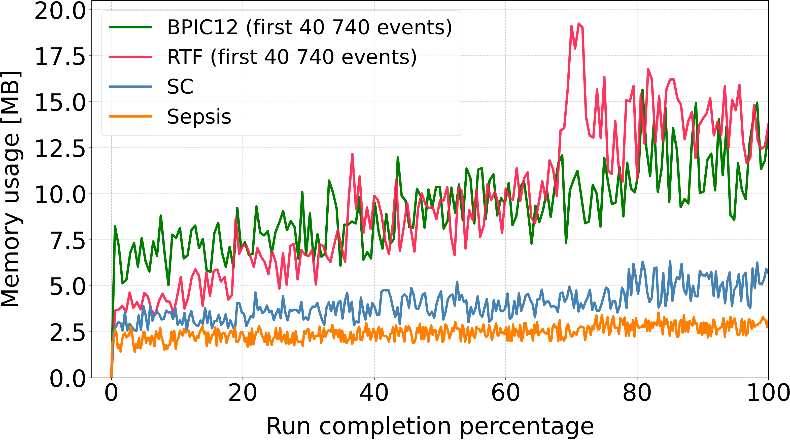
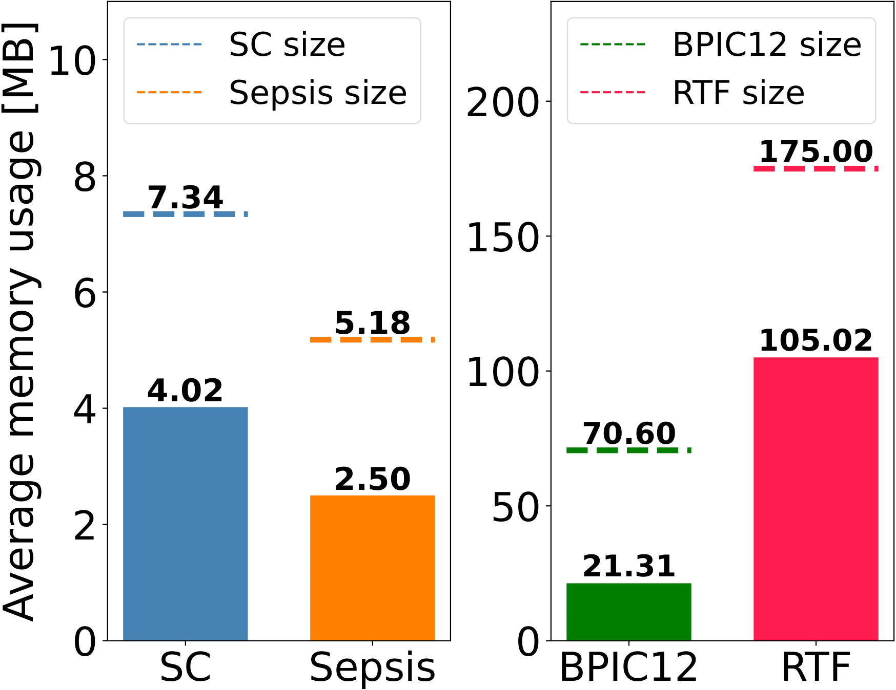
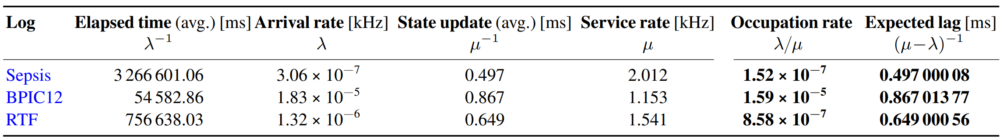
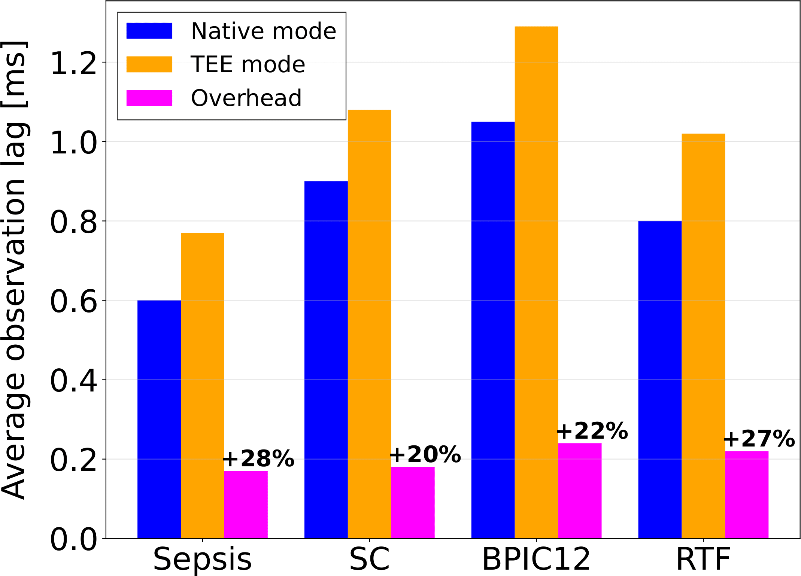

# ProMTEE: Preserving data secrecy for online process monitoring

This repository contains the published prototype of ProMTEE, a framework to preserve data secrecy for online process monitoring. ProMTEE leverages trusted applications running in Intel SGX TEEs to execute control flow and compliance checking monitoring tasks, while hiding sensitive information of the input events.

## Framework Overview

ProMTEE is centered around the Process Vault, Process State Agents, and Event Stream Generators, ensuring secure and efficient online process monitoring.
The Process Vault is the core computational unit of the framework, responsible for securely maintaining and updating the process state. It is implemented as an EGo Trusted Application running within an Intel SGX Trusted Execution Environment (TEE), which guarantees data confidentiality and code integrity. Internally, the Process Vault consists of several components: the Event Dispatcher, which receives and decrypts incoming events, the Process State Manager, which processes these events and updates the process state, and the Process Trackers, which execute monitoring tasks such as control flow validation and compliance verification. Once deployed within the TEE, the Process Vault becomes immutable and resistant to external tampering, ensuring that event data remains protected from unauthorized access.

The Process State Agents act as intermediaries between organizational information systems and the Process Vault. These agents are lightweight GO applications that collect and preprocess event data before securely transmitting it. They retrieve events from the organization’s Event Stream Engine, encrypt them using keys generated within the TEE, and forward them to the Process Vault through a secure channel. To prevent unauthorized data access, the agents also perform periodic attestation verification, ensuring that they are communicating with a legitimate Process Vault instance running within a trusted environment. This verification mechanism relies on cryptographic proofs generated by the TEE, confirming the integrity and authenticity of the monitoring system.

The Event Stream Generators operate at the organizational level and serve as the primary data sources for process monitoring. These components extract event data from business process management systems or enterprise information systems, producing structured event streams that capture process execution details.

## Project Structure

The project structure from the root directory is as follows:

```
Preserving-event-streams-secrecy-in-distributed-process-monitoring/
├── data/
│   ├── BPMN/ : contains the bpmn process models for our tests
│   ├── input/ : files that can be red by the Process Vault at runtime. Contains the extraction manifest for each log configuration 
│   ├── output/ : files outsourced from the TEE. Typically used to register runtime memory and latency profiling data 
│   ├── PLG/...
│   ├── plot/ : python scripts for plotting the results of our experiments
│   ├── PNML/ : contains the pnml process models for our tests
│   ├── regoConstraints/ : implementations of the monitored business rules for each test log in Rego policy language
│   ├── xes/ : event logs in xes format
│   ├── testResults/ : data results our experiments 
├── eventStreamGenerator/ : scripts to simulate a process engine
│   ├── PLG-2.0.5/...
│   ├── event_stream_from_log.py : script generating an event stream from an input event log
│   ├── generate_event_log_from_stream.py : record an event log from an event stream generated via PLG
├── processVault/ : folder containing the implementation of the Process Vault
│   ├── complianceCheckingLogic/ : here we keep the logic of the Compliance Rule Tracker. The content of this folder is dynamically generated by the processVaultCompler.py according to the input Rego rules
│   ├── eventDispatcher/ : the Event Dispatcher of the Process Vault
│   ├── processStateManager/ : the Process State Manager of the Process Vault
│   ├── workflowLogic/ : here we keep the logic of the Control Flow Tracker. The content of this folder is dynamically generated by the processVaultCompler.py according to the input PNML files
├── processStateAgent/ : folder containing the implementation of the Process State Agent 
├── testConfigurations/ : this folder contains the sh files to reproduce our tests
│   ├── simulationMode/ : configurations to run the tests in simulation mode (non-TEE) 
│   ├── teeMode/ : configurations to run the tests in TEE mode
├── queue/ : scripts to handle a queue of events outside the TEE
├── utils/ : contains utility modules
├── main.go : main of the Process Vault
```


## Setup
### Dependencies

To set up and run the project, you need to have the following dependencies installed:

- Go (version 1.16 or later)
- Python (version 3.6 or later)
- pm4py (Python library for process mining)
- ego (Edgeless Systems' confidential computing framework)
- Intel SGX enabled CPU (required to run the process vault in non-simulation mode)

### Environment Setup

1. Clone the repository:

   ```sh
   git clone https://github.com/dave0909/Preserving-event-streams-secrecy-in-distributed-process-monitoring.git
   cd Preserving-event-streams-secrecy-in-distributed-process-monitoring
   ```

2. Install Go dependencies:

   ```sh
   go mod tidy
   ```

3. Install Python dependencies:

   ```sh
   pip install pm4py
   ```

4. Set up ego (refer to the official documentation for detailed instructions):

### Docker Image

You can also use our Docker image to run the project. The Docker image contains all the necessary dependencies and configurations to run ProMTEE.

To pull the Docker image, use the following command:

```sh
docker pull dave0909/promtee
```

You can run the Docker container using the following command:

```sh
docker run -it dave0909/promtee
```

## Running the Project
To run our prototype you need to execute these three steps:
- 1) Bootstrap a Process Vault instance using a the `processVaultCompiler.py` script
- 2) Start a Process State Agent that connects to the Process Vault
- 3) Start the Event Stream Engine simulator to generate XES events from an event log 
### Bootstrap a Process Vault
> [!IMPORTANT]  
> To run a Process Vault, you need an Intel SGX-enabled machine. Ensure the correct installation of the Intel SGX and EGo SDKs.

To bootstrap a Process Vault instance in the TEE, you need to use the processVaultCompiler.py script. This script fetches the input process specifications and generates the source of the process vault to launch. The command to use the process vault compiler is as follows:
   ```sh
   python3 processVaultCompiler.py ./data/PNML/motivatingreduced.pnml ./workflowLogic/workflowLogic.go ./data/regoConstraints/motivatingConstraints ./complianceCheckingLogic/complianceCheckingLogic.go localhost:6066 data/input/extraction_manifest_motivating.json false true 40000 false 200
   ```
   Parameters for running the Process Vault Compiler:
   - `bpmn_file_path`: The path to the BPMN or PNML file.
   - `output_go_file_path`: The path to the output Go file for the workflow logic.
   - `constraint_folder_path`: The path to the folder containing the Rego constraint files.
   - `output_go_file_path_compliance`: The path to the output Go file for the compliance checking logic.
   - `event_dispatcher_address`: The address to bind the RPC server for the event dispatcher.
   - `extraction_manifest_file_path`: The path to the extraction manifest file.
   - `isInSimulation`: Boolean indicating whether to run in simulation mode.
   - `isInTesting`: Boolean indicating whether to run in test mode.
   - `nEvents`: The number of events to process.
   - `withExternalQueue`: Boolean indicating whether to enable external query.
   - `slidingWindowSize`: The size of the sliding window for event processing.

### Start the Process State Agent
To start up a Process State Agent, navigate to its folder and use the following command.
   ```sh
   cd procesStateAgent
   ego-go run processStateAgent.go localhost:6065 localhost:1234 false true
   ```

   Parameters for running the process state agent:
   - `psaServer`: The address to bind the RPC server.
   - `esgAddress`: The address of the event stream generator.
   - `skippAttestation`: Boolean indicating whether to skip attestation.
   - `testMode`: Boolean indicating whether to run in test mode.

### Start the Event Stream Generator
To simulate a process engine and generate XES events to be transmitted to the Process Vault, we developed a Python script taking as input an XES event log. You can use it as follows:
   ```sh
   cd eventStreamGenerator
   python3 event_stream_from_log.py ../data/xes/motivatingnew.xes
   ```

   Parameters for running the Python script to simulate an Event Stream Generator:
   - `log_path`: The path to the XES event log file.

## Tests
This repository contains runtime experiments on the Process Vault's memory usage and responsiveness. For these tests, we employed the event logs contained in the `/data/xes` folder:
- **motivatingnew.xes**: a synthetic event log modelling a supply chain scenario
- **sepsis.xes**:  a real-world event log containing events of sepsis cases from a hospital [(sepsis documentation)](https://data.4tu.nl/articles/dataset/Sepsis_Cases_-_Event_Log/12707639)
- **bpic2012.xes**: a real-world event log of a loan application process [(BPIC 2012 documentation)](https://data.4tu.nl/articles/_/12689204/1)
- **trafficFines.xes** a real-world event log of an information system managing road traffic fines [(road traffic fines documentation)](https://data.4tu.nl/articles/dataset/Road_Traffic_Fine_Management_Process/12683249)

### Test Configurations
In `/testConfigurations`, we collect the SH scripts to reproduce the test runs for each event log. The available test modes are:

- `simulationMode`: running tests in simulation mode (without the TEE)
- `teeMode`: running tests in Trusted Execution Environment (TEE) mode

All the SH scripts launch a Process Vault in the TEE, initiate a Process State Agent, and start an Event Stream Engine to generate XES events from a given event log.

### Running our tests

To run a test, navigate to the appropriate test mode directory and execute the desired test script. For example, to run the BPIC2012 test in TEE mode:

```sh
cd testConfigurations/teeMode
./runBPIC2012.sh
```
Depending on the specific test, the execution of the experiment may take a while. The end of the test is notified within the terminal.

### Results
At the end of each test, you can find the observation results in `data/output/`. We distinguish three types of result files:
- `memory_usage.csv`: contains a set of points (timestamp, memory usage) collected in the course of the execution
- `delay_results.csv`: each row i contains the generation timestamp of the i-th event (second column) and its processing timestamp (third column) within the Process Vault 
- `latency.csv`: contains the duration of the test, the average duration of the state update (between all the processed events), the minimum state update latency, the maximum state update latency, and the standard deviation

We collect these files resulting from our tests in the `data/testResults` folder. In this location, we collect the profiling files according to their collection date. The latest test results are collected in the `data/testResults/19.02.2025` folder

### Plots
You can use the files resulting from each test run to produce plots via the Python scripts collected in the  `data/plot`. To use these files, you may need to change the path of the input files or adjust the scale parameters of the axis. We describe the usage of each file as follows:
Script | Test file | Description 
--- | --- | --- 
`plotMemory.py` | `memory_usage.csv` | It generates the plot line describing the memory usage trend at runtime
`plotMultiMemory.py` | `memory_usage.csv` | It generates a plot that compares multiple memory usage trends, deriving from more experiments
`plotMultiMemoryGC.py` | `memory_usage.csv` | Same as the previous line, but we use it to compare multiple garbage collection policies with the same dataset (Road Traffic Fines)
`plotBarMemory.py` | `memory_usage.csv` | It generates a bar plot comparing average memory usage and log size for different logs. You have to manually calculate the average memory usage from `memory_usage.csv and insert it into the script.
`plotDelay.py` | `delay_result.csv` | It analyzes event processing delays and generates multiple plots, including a main delay plot, a box plot, and a moving average trend plot
`plotMultiBox.py` | `delay_result.csv` | It generates a min-max delay comparison plot for multiple files
`plotMultimemoryBroken.py` | `memory_usage.csv` | It generates a plot with a broken y-axis comparing memory usage trends for multiple datasets
`plotSimVStee.py` | `delay_result.csv` | It generates a bar plot comparing the observation lag overhead between native mode and TEE mode. You have to manually compute the average delay from the `delay_result.csv` output files from TEE and Simulation runs. Insert these average delays into a file like `output/testResults/19.02.2025/TEEvsSIM.csv` and run the script.

### Memory Usage
Here, we aim to test whether the runtime memory demand of the Process Vault for processing real-world workloads is compatible with the constrained capacity of TEEs. In Figure 1, we illustrate the runtime memory utilization trend of the Process Vault across the event logs. For the sake of readability, we cut the figure's viewpoint to the number of observations collected with the SC log (40740). As expected, due to the cumulative growth of the accessible state section, all the values display an upward trend. The processing of the Sepsis dataset (orange line) exhibits the lowest and most stable growth, consistently remaining below 3 MB throughout execution. The SC test (in blue) follows a similar trend, gradually rising from approximately 2.5 MB to 5.5 MB. In contrast, the runs with BPIC12 and RTF (in green and red, respectively) show higher memory demands due to a more significant number of constraints associated with the logs (8 and 16, respectively, as per Table 1). From the start, BPIC12 requires higher memory allocation. However, RTF exhibits a steeper increase in memory consumption compared to BPIC12, diverging significantly after 60% of the events are fetched. At its peak, the memory usage with RTF exceeds 15 MB. This behavior is attributable to the higher ratio of cases per parsed event(0.30 in RTF compared to 0.05 in BPIC12), which necessitates the allocation of additional data structures to manage more process constraints and control flow states simultaneously. In this analysis, we observe the increasing amplitude of memory fluctuations as execution progresses. This effect becomes more pronounced as the process state grows larger, thus posing a potential threat to the robustness of our solution. Upon further investigation, we were able to relate this phenomenon to the low-level garbage collection policy of the Process Vault implementation. In Figure 2, we present the full view of the memory usage trend of the RTF log (the largest one) under three different garbage collection policies. The default garbage collection policy (the red line) operates adaptively based on the current memory utilization. This policy generates increasingly wide memory oscillations, exceeding the total log size threshold more frequently after 60 % of execution and peaking around 270 MB. These peaks correspond to the dynamic expansion of in-memory data structures. To control these fluctuations, we implemented two custom garbage collection policies based on fixed time intervals: (1) every 50 ms and (2) every 10 ms. The former reduces peak memory usage to approximately 180 MB, maintaining a more stable profile with an oscillation amplitude that stabilizes after 20 % of the run (the green line). The latter further lowers memory consumption, keeping it consistently below 120 MB with minimal fluctuations and peaking at approximately 150 MB (the blue line). These memory savings come at the cost of increased execution time (annotated in the plot to the right side, at the end of each poly-line). While custom policy 2 minimizes memory usage, it significantly increases runtime ( 14 min 11 s) due to the overhead introduced by frequent memory management operations. Conversely, the default policy achieves the fastest execution time (7 min 36 s) but at the expense of high memory consumption. Custom policy 1 strikes a balance with 8 min 13 s. Figure 3 presents the average runtime memory usage of the ProcessVault for each test. To provide a meaningful context for these values, we compare them to the total size of the corresponding logs. The average memory consumption of the ProcessVault remains significantly lower than the total log size. We also remark no out-of-memory errors occurred during the conduction of these experiments.

 

*Figure 1: Generated with `data/plots/plotMultiMemory.py`*    *Figure 2: Generated with `data/plots/plotMultiMemoryGC.py.`*



*Figure 3: Generated with `data/plots/plotMultiMemory.py`*

### Responsiveness
To assess the responsiveness of our solution (Obj. O3), we first verify that the Process Vault introduces minimal observation lag (i.e., the difference between the event processing time and its generation time) compared to the elapsed time (i.e., the time interval between two consecutive generic events) in real-world executions. We want to avoid, in other words, that the queue of unprocessed events gets out of control and leads to a damaging loss of responsiveness. Therefore, we model the event fetching from the EventDispatcher to the Process State Manager as an M/M/1 queue. We exclude considerations of networking overhead and packet loss as they fall outside the scope of this study. Figure 4 displays the average elapsed time of the event logs. These values serve as a basis for the expected arrival rates (λ).  We assume that events within the logs occur adhering to a Poisson process, which effectively represents multiple-case arrivals. In the table, we also report the average state update latency, i.e., the mean time the Process State Manager takes to process an event. We use it as a basis to compute the service rate (μ) of the ProcessVault for each log. The BPIC12 test exhibits the highest state update latency (0.867 ms), attributable to the larger number of business rules compared to the other logs, followed by RTF ( 0.649 ms)and Sepsis (0.497 ms). Using the computed λ and μ, we apply the M/M/1 occupation rate equation to determine the expected lag. Figure 4 displays the outcome. The ProcessVault achieves utilization rates in the order of 10−7 to 10−5, hence much closer to the theoretical minimum of 0 than to the divergence threshold of 1. This result evidences that the system remains stable and responsive without queue overloading. The expected lags are of the same magnitude as the state update latency, thus signifying that the processing time does not cumulatively increment over time. These findings suggest that ProcessVault manages real-world execution settings by maintaining observation lag at a minimum.TEEs’ hardware-based encryption introduces performance overhead due to its hardware-based encryption mechanism. Hence, we want to ensure that this overhead ranges within predictable intervals and does not lead to diverging lags. To this end, we timed theProcessVault running in a non-TEE environment (thus disabling the trusted subscription phase). Figure 5 plots the average lag for each tested log in both non-TEE and TEE settings(the blue and orange bars, respectively) alongside the delta (magenta). We observe that the overhead ranges between 0.17 ms to 0.25 ms (with Sepsis and BPIC12, respectively). The highest delta is registered with Sepsis, with an increase of 28 % in TEE mode. RFT, BPIC12, and SC follow with 27, 22, and 20 %, respectively. The narrow range of these values suggests that the overhead introduced by our approach is not strictly dependent on the overall workload, indicating that the additional latency remains manageably bounded.



*Figure 4: Generated with `data/plots/plotBarMemory.py`*



*Figure 5: Generated with `data/plots/plotSimVStee.py`*


